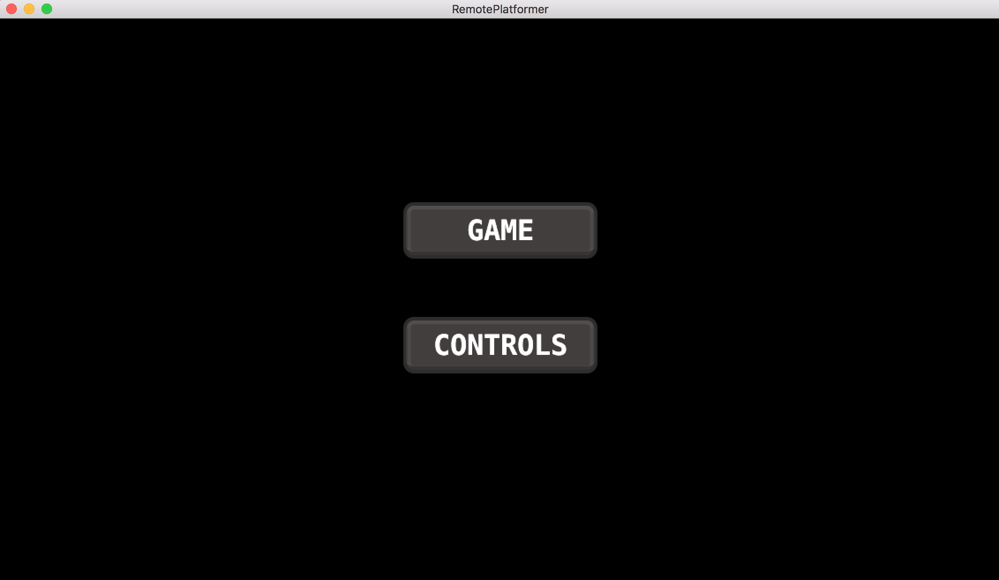
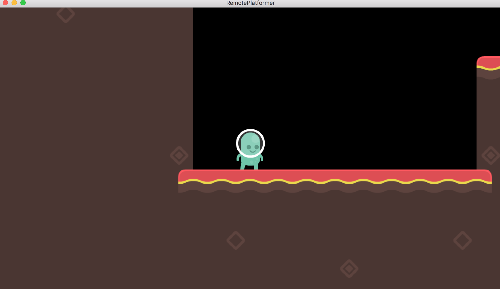
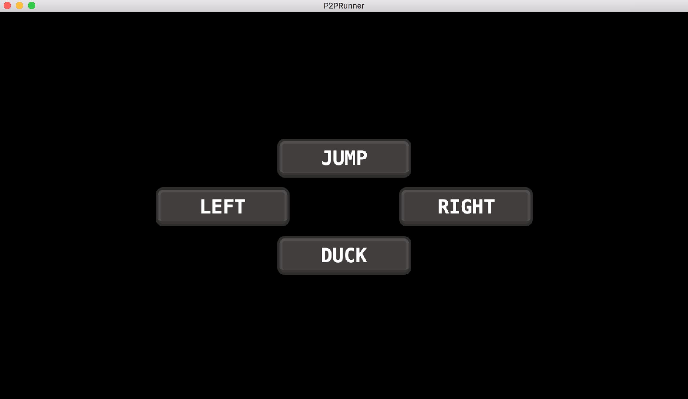

# remoteplatformer
This example project shows how to find a host application and connect to it and start sending commands. This is done in the context of a platformer game where the game hosts a P2P discovery service to which a client can connect and send commands over a UDP socket to control the player.

The example is created from a number of different Defold library projects. The connectivity is handled by the following two library projects:

* [DefNet](https://github.com/britzl/defnet) - Defold Networking module. This is where the P2P discovery module resides.
* [LuaSocket](https://github.com/britzl/defold-luasocket) - LuaSocket support functionality. Used by DefNet.

The P2P discovery and UDP connection is wrapped into Lua module to handle the entire connectivity flow. This logic can be found in the `remote.control.lua` module and it is used in `player.script` where the host is created and `controls.script` where the client is created.

The platformer game and UI is created using the following library projects:

* [Gooey](https://github.com/britzl/gooey) - GUI components
* [Monarch](https://github.com/britzl/monarch) - Screen manager
* [Platypus](https://github.com/britzl/platypus) - Platformer logic
* [Defold-Orthographic](https://github.com/britzl/defold-orthographic) - Camera tools (for following the player)
* [Defold-Timer](https://github.com/britzl/defold-timer) - Timer for repeating tasks

## How to run the example
Bundle the game to an application, either desktop or mobile. Launch the application on two devices (or two instances of the application on a single desktop computer). When the application is launched a mode selection menu is shown:

Select `Game` from the menu to start the platformer game on one device. This device will act as the host and start broadcasting P2P messages for clients to discover.

Select `Controls` on the second device to show control buttons to control the game. This device will act as the client and start to listen for a broadcasting host.

